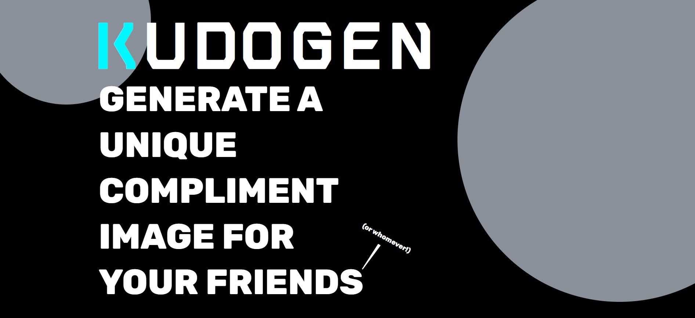

# KUDOGEN

This will be a compliment generator for people you know. It's a fun combination of direct input and unpredictable results, half user prompts and half personality test for a third party.

## [🧾 Live Site](https://ktpeace.github.io/kudogen/)

## TO DO AS OF 2/15

### NEXT

- fine-tune results appearance
- make darker colors lighter
- make camera button save to images for mobile

### LATER

- make actual .png sizes smaller & remove unneeded from project
- move defaults to original states in code files
- add reset button for adjs + feelings
- handle a default routing/404 case
- enable right click open submit button
- add more feelings
- make emojis variable
- make sure results starts with scrollbar at top
- a few more adjs? analytical/rational/logical/formulaic
- remove unnecessary dependencies like htmltocanvas
- change colors to not need to plug in hashtags so any color format works in arrays
- refactor code
